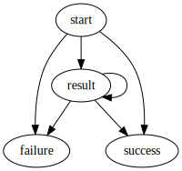

# pipeline

This repo is the pipeline library and runtime.

Each block is a folder inside [src/blocks](./src/blocks), and has three parts: an interface, an editor, and a runtime. Interfaces are values of the generic type `Block<State, Inputs, Outputs>`; runtimes are values of the generic type `Evaluate<State, Inputs, Outputs>`; and editors are values of the generic type `Editor<State>`. These types are defined in [src/types.ts](./src/types.ts).

An object of all block interfaces is exported from [src/blocks/index.ts](./src/blocks/index.ts); an object of all block runtimes is exported from [src/blocks/runtimes.ts](./src/blocks/runtimes.ts); and an object of all block editors is exported from [src/blocks/editors.ts](./src/blocks/editors.ts).

## Interfaces

Block interfaces are the default export of src/blocks/\[block-name\]/index.ts (e.g. [src/blocks/csv-import/index.ts](./src/blocks/csv-import/index.ts)). A block interface is generic in three parameters: `State`, `Inputs extends Record<string, Schema.Schema>`, and `Outputs extends Record<string, Schema.Schema>`, and it contains runtime validators for the state type and each input and output schema.

```typescript
interface Block<
	State,
	Inputs extends Record<string, Schema.Schema>,
	Outputs extends Record<string, Schema.Schema>
> {
	state: t.Type<State>
	inputs: {
		[input in keyof Inputs]: t.Type<Inputs[input], Inputs[input], Schema.Schema>
	}
	outputs: {
		[output in keyof Outputs]: t.Type<
			Outputs[output],
			Outputs[output],
			Schema.Schema
		>
	}
	validate: (state: State, schemas: Inputs) => Outputs
}
```

Block interfaces also have a `validate` function that produces output schemas given a state and input schema object.

## Editors

Block editors are the default export of src/blocks/\[block-name\]/editor/index.tsx (e.g. [src/blocks/csv-import/editor/index.tsx](./src/blocks/csv-import/editor/index.tsx)). Editors are generic in just the `State` parameter:

```typescript
type Editor<State> = React.FC<{
	state: State
	setState: (state: State) => void
}>
```

## Runtimes

Block runtimes are the default export of src/blocks/\[block-name\]/runtime/index.ts (e.g. [src/blocks/csv-import/runtime/index.ts](./src/blocks/csv-import/runtime/index.ts)). Runtimes are a function `Evaluate` that is generic in all three parameters:

```typescript
type Evaluate<
	State,
	Inputs extends Record<string, Schema.Schema>,
	Outputs extends Record<string, Schema.Schema>
> = (
	state: State,
	schemas: Inputs,
	instances: { [input in keyof Inputs]: Instance.Instance<Inputs[input]> }
) => Promise<{
	schemas: Outputs
	instances: { [output in keyof Outputs]: Instance.Instance<Outputs[output]> }
}>
```

## Graphs

Pipelines are represented as graphs:

```typescript
type NodeID = string
type EdgeID = string
type Graph = {
	nodes: Record<
		NodeID,
		{
			kind: string
			inputs: Record<string, EdgeID>
			outputs: Record<string, EdgeID[]>
			state: unknown
		}
	>
	edges: Record<
		EdgeID,
		{
			source: { id: NodeID; output: string }
			target: { id: NodeID; input: string }
		}
	>
}
```

... although this type is not defined as such - instead we use the runtime validator `Graph` exported from [src/graph.ts](./src/graph.ts), which also validates the graph structure proper (edges connecting valid outputs to valid inputs).

## Worker

The [worker/index.ts](./worker/index.ts) script starts a kafka consumer on topic `pipeline-evaluate` that receives pipeline graphs and evaluates the blocks in topological order.

The worker emits JSON events on topic `pipeline-evaluate-event`. Each event has a `.event` property that is one of `start`, `result`, `failure`, or `success`. Every pipeline execution begins with a `start` event and ends with _either_ a `failure` or `success` event, with zero or more `result` events in-between.


